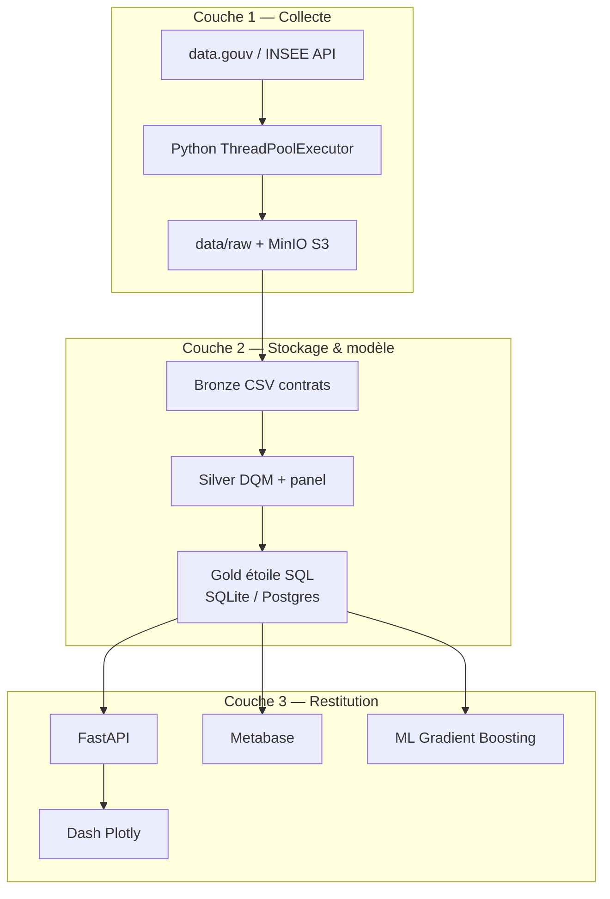

# Architecture 3 couches (compétence C2) — vue synthétique

| Couche | Techno POC | Preuve dans le repo |
|---|---|---|
| Collecte | Python, urllib, ThreadPoolExecutor | `etl/01_download.py` |
| Stockage | Pandas, SQLite, Postgres, MinIO | `etl/02_transform.py`, `etl/03_sync_datalake.py` |
| Restitution | FastAPI, Dash, Metabase, scikit-learn | `backend/`, `frontend/`, `docker-compose.yml` |
