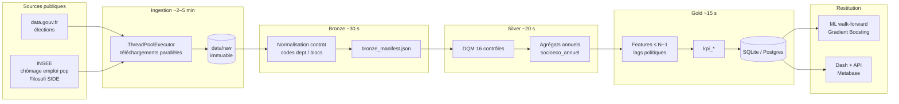
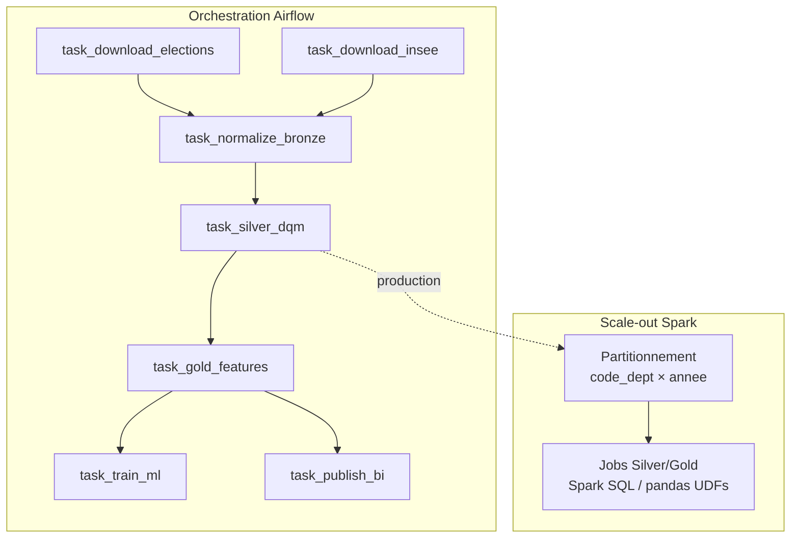

# Diagrammes de flux — Electio-Analytics

## C1 — Flux ETL / médailon (timing indicatif)

**Timing POC (ordi portable)** : ingestion I/O-bound parallèle sur 5 fichiers élections ; transform pandas local < 1 min ; ML walk-forward ~20–40 s.

**PNG livrés** : [`diagrams/flux_etl_medaillon.png`](diagrams/flux_etl_medaillon.png) (flux ETL) et [`diagrams/scale_out.png`](diagrams/scale_out.png) — insérés dans le dossier Word et le deck. Sources : `flux_etl.mmd` / `flux_etl.html`, `scale_out.mmd` / `scale_out.html`.

## C3 — Pipeline distribué (scale-out)

### Paragraphe scale-out chiffré
En production, chaque source est une tâche Airflow **idempotente**. Les élections (5 fichiers) restent **parallèles** (fan-in vers Bronze). Silver/Gold passent sur Spark avec partitionnement `code_dept` (96 partitions naturelles) × `annee` : pour ~10³–10⁶ lignes le gain est surtout organisationnel ; au-delà (infra-communal, quotidien), le même DAG scale horizontalement. Object storage S3/OVH remplace MinIO ; le warehouse Postgres/Metabase consomme uniquement **Gold**.

Voir aussi `ARCHITECTURE_BIGDATA.md` (même dossier) et le stub `orchestration/dags/electio_etl_dag.py`.
