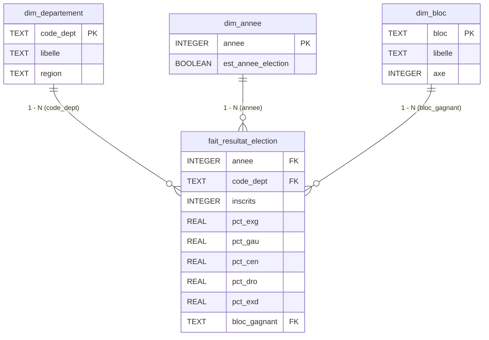

# Schéma en étoile — Electio-Analytics

> Slide / livrable BI aligné sur `db/init.sql` et `sql/schema.sql`.  
> Image : [`diagrams/schema_etoile_electio.png`](diagrams/schema_etoile_electio.png)

## Choix

| Modèle | Décision |
|---|---|
| **Étoile** | **Retenu** — **1 fait** au centre, dimensions dénormalisées autour |
| Flocon | Évalué, non retenu (peu de gain à 480 obs) |
| Grappe | Évaluée : plusieurs faits (`fait_*`) partageant les dims — **hors slide étoile** |
| Table GOLD | Couche de **service** ML/Dash (dénormalisée) — **pas** une 2ᵉ table de faits sur le schéma étoile |

## Grain

**1 département × 1 scrutin présidentiel T1** → 96 × 5 = **480** lignes dans le fait.

## Cardinalités (étoile stricte)

Toutes les relations dimension → fait sont en **1 — N**.

| Relation | Côté 1 | Côté N | Clé | Sens métier |
|---|---|---|---|---|
| `dim_departement` → `fait_resultat_election` | 1 département | N faits | `code_dept` | 1 dept × 5 scrutins |
| `dim_annee` → `fait_resultat_election` | 1 année | N faits | `annee` | 1 scrutin × 96 départements |
| `dim_bloc` → `fait_resultat_election` | 1 bloc | N faits | `bloc_gagnant` | 1 bloc en tête dans N depts |

Notation Mermaid : `||--o{` = **1** (dimension) vers **N** (fait).

## Diagramme (Mermaid) — étoile seule

## Volumétrie

| Table | Lignes | Rôle dans l’étoile |
|---|---:|---|
| `dim_departement` | 96 | Dimension géographie |
| `dim_annee` | 5 scrutins (2002–2022) | Dimension temps |
| `dim_bloc` | 5 | Dimension politique (EXG/GAU/CEN/DRO/EXD) |
| `fait_resultat_election` | 480 | **Fait central** |

### Hors étoile (à ne pas mélanger sur le slide)

| Table | Rôle |
|---|---|
| `gold_dataset_analytique` | Table de service (features ML + lags anti-leakage) |
| `kpi_*` | Agrégats de restitution |

## Phrase orale (niveau 3)

« Schéma en étoile strict : un seul fait `fait_resultat_election` (grain dept × scrutin), trois dimensions `dim_departement`, `dim_annee`, `dim_bloc`, cardinalités 1–N. La table GOLD est une couche de service pour le ML, pas un second fait du modèle étoile. »
